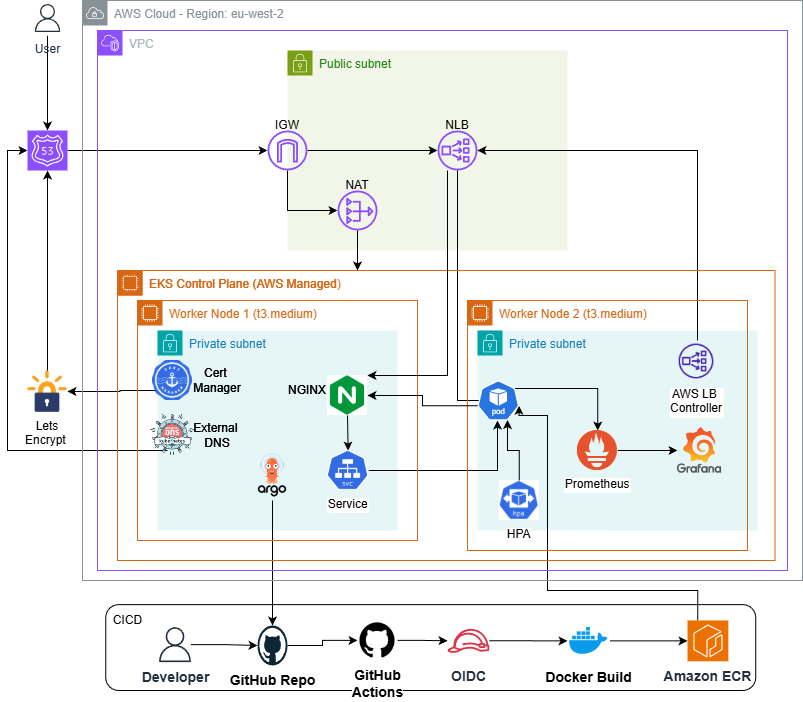
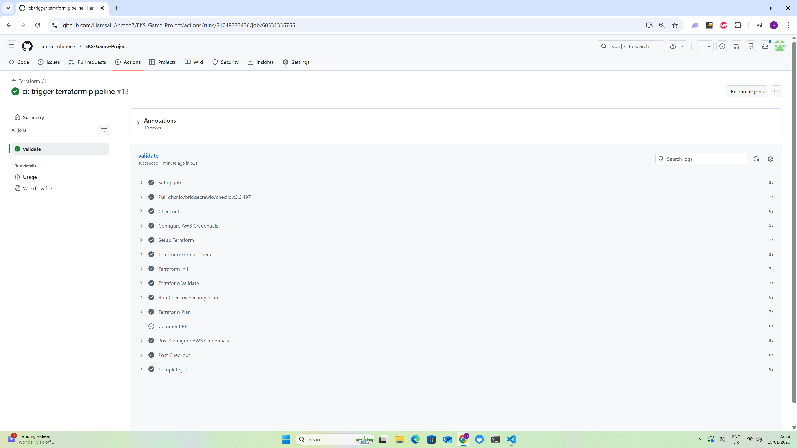
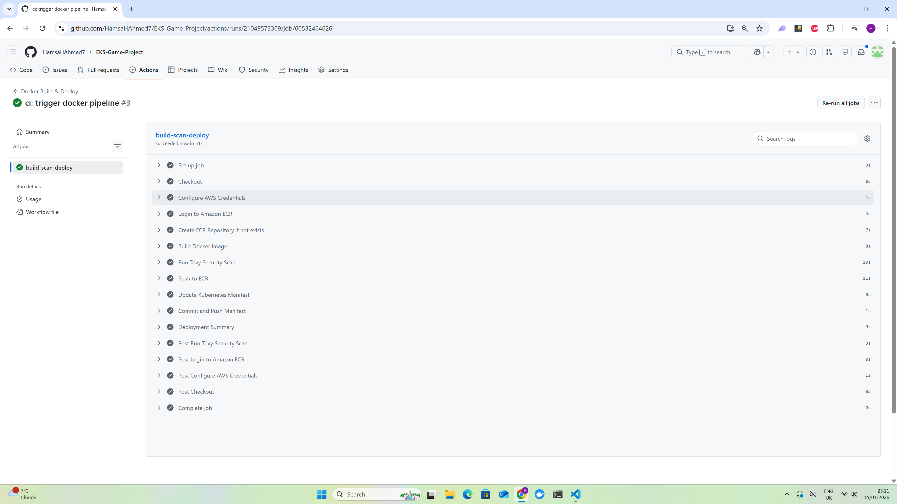
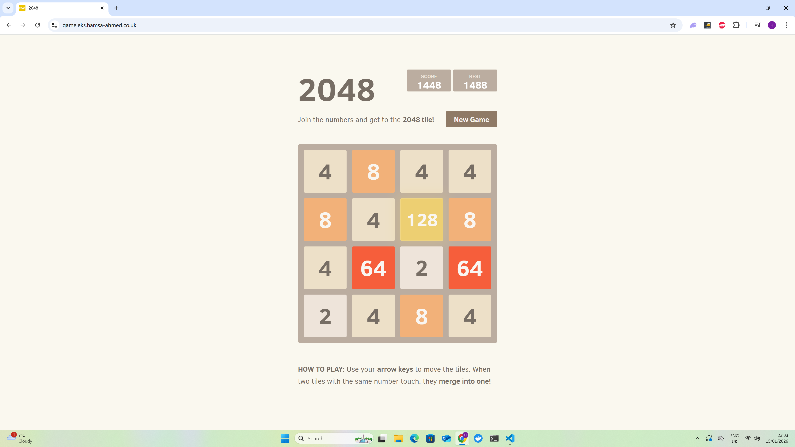
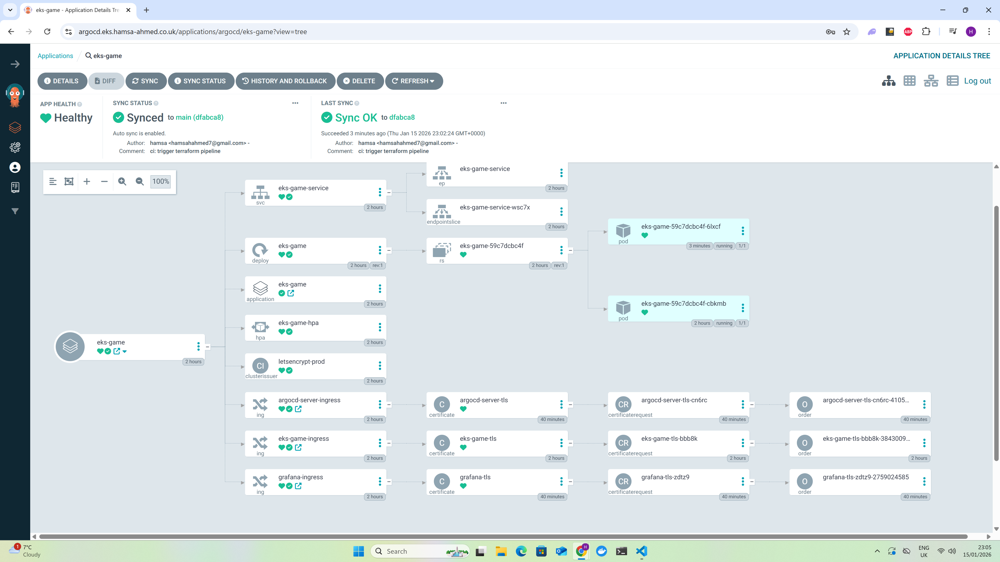
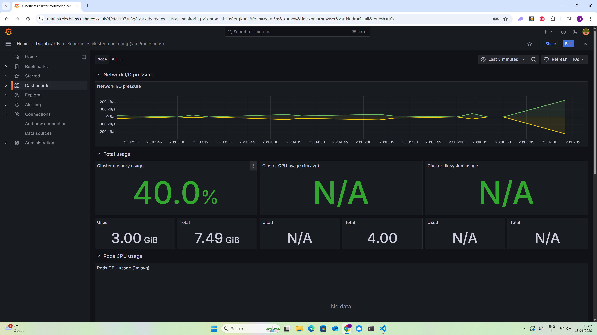

# EKS 2048 Game - Production Kubernetes Deployment

Production-grade application deployment on Amazon EKS with full automation, GitOps, and monitoring.

**Live:** https://game.eks.hamsa-ahmed.co.uk


---

## Overview

Complete cloud-native deployment demonstrating:
- Infrastructure as Code with Terraform
- Automated CI/CD pipelines
- GitOps with ArgoCD
- SSL/TLS automation
- Monitoring and observability



---

## Tech Stack

**Infrastructure:** AWS EKS, VPC, Route53, ECR  
**IaC:** Terraform with modular design  
**Container:** Docker, NGINX  
**Orchestration:** Kubernetes 1.31  
**GitOps:** ArgoCD  
**Ingress:** NGINX Ingress + AWS Load Balancer Controller  
**SSL:** cert-manager + Let's Encrypt  
**DNS:** ExternalDNS  
**Monitoring:** Prometheus + Grafana  
**Security:** Trivy, Checkov  
**CI/CD:** GitHub Actions  

---

## Quick Start

**1. Configure variables** in `infra/terraform.tfvars`

**2. Deploy infrastructure:**
```bash
cd infra
terraform init
terraform apply
```

**3. Configure kubectl:**
```bash
aws eks update-kubeconfig --name eks-game-eks-cluster --region eu-west-2
kubectl apply -f kubernetes/
```

**4. Update Route53 NS delegation and wait for certificates**




---

## CI/CD Pipelines

**Pipeline 1 - Terraform Validation:**
- Terraform fmt, init, validate
- Checkov security scanning
- Plan generation for review


**Pipeline 2 - Docker Deployment:**
- Build image → Trivy scan → Push to ECR
- Update manifest → ArgoCD auto-deploys




**GitOps Flow:**
```
Code Push → CI builds image → Updates K8s manifest → 
ArgoCD syncs → Rolling deployment
```

---

## Live Services

**Application:**  
https://game.eks.hamsa-ahmed.co.uk




**ArgoCD:**  
https://argocd.eks.hamsa-ahmed.co.uk  
Login: `admin` / `kubectl get secret argocd-initial-admin-secret -n argocd -o jsonpath="{.data.password}" | base64 -d`




**Grafana:**  
https://grafana.eks.hamsa-ahmed.co.uk  
Login: `admin` / `admin123`




---

## Monitoring

Prometheus collects metrics from cluster, nodes, pods, and ingress.  
Grafana dashboards show:
- Cluster resource usage
- Pod health and scaling
- NGINX traffic and latency
- Node metrics


---

## Security

- Checkov IaC scanning (57 passed checks)
- Trivy container scanning (0 vulnerabilities)
- Let's Encrypt SSL certificates
- IAM Pod Identity (no static credentials)
- Private subnets for worker nodes

---

## Scaling

HPA configuration: 2-10 pods, 70% CPU target  
Automatically scales based on load

---

## Teardown
```bash
cd infra
./tear-down.sh
```

---

## Key Features

- **Full automation:** One command infrastructure deployment
- **GitOps:** Git as single source of truth
- **Zero-downtime:** Rolling deployments via ArgoCD
- **Security scanning:** Automated vulnerability detection
- **SSL automation:** Certificates managed by cert-manager
- **Dynamic DNS:** ExternalDNS syncs ingress to Route53

---

## Project Structure
```
├── app/                 # Application code
├── infra/
│   ├── modules/        # Terraform modules
│   ├── kubernetes/     # K8s manifests
│   └── values/         # Helm configurations
└── .github/workflows/  # CI/CD pipelines
```

---

## Author

Hamsa Ahmed

## License

MIT